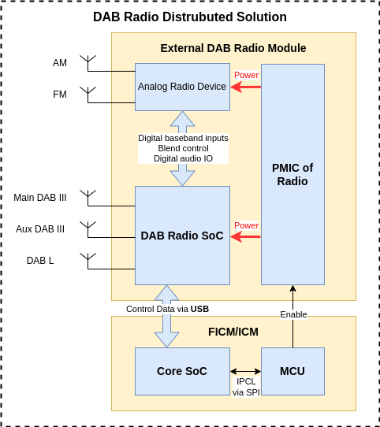
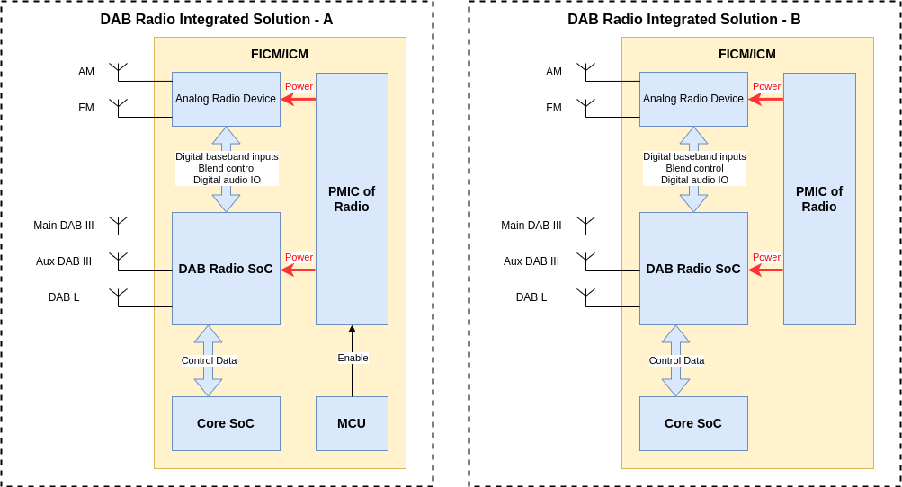
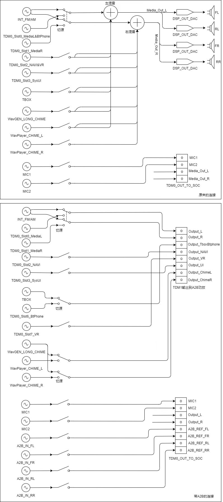

# Extreme Energy Saving Strategy for FICM - DAB Radio

## 1 Overview

### 1.1 Background

From the eletrical-battery-power-train vehicle perspective, any consumption of low-voltage-system eletrical components might produce the non-essentional waste of battery power, which could has impact to vehicle users' real capable mileage.

Therefore, this solution is trying to save low-voltage-system eletrical components consumption while users are not using. In addition, the applied energy saving solution would not cause any obvious unhappy exerperience from user standpoint.

### 1.2 Requirements Brief

Regarding to the external DAB radio module which has approximately 6W power consumption.

If an eletrical vehicle's power efficiency is 9km/1kwh, saving 6W power consumption could contribute approximately extra 6 multiplies 9 equals 54m of moving range per hour.

Therefore it is valuable to design and apply an "extreme" energy saving strategy for this extra 54m moving range from user usage perspective.

### 1.3 Acronyms

- FICM: Front Infortainment Control Module
- DAB: Digital Audio Broadcasting
- FM/AM Radio: Frequency Modulation/Analog Modulation Radio

## 2 Scope

### 2.1 Functional Scope

This documentation is **ONLY** applicable for the "extreme" energy saving strategy of _FICM_ radio functions:

- DAB
- FM/AM

### 2.2 Vehicle Program Scope

This documentation is **ONLY** applicable for SAIC international MG brand vehicles which installed the particular _FICM_ with _external DAB radio module_, or _independent DAB radio module_.

### 2.3 FICM Hardware Platform Scope

This documentation is **ONLY** applicable for _SAIC FICM2712 Platform with external DAB radio module_. From the _DAB radio module_ perspective, it is so-called "DAB Radio Distrubuted Solution" on the left side as bellow diagram.

### 2.3.1 DAB Radio Hardware Block Diagram - Distribution



### 2.3.2 DAB Radio Hardware Block Diagram - Integration



### 2.4 Regulation

- EN50067
- IEC62106
- UKSI 2017 / 1206 for radio equipment 2017 and all its amendments
- OFCOM standards
- etc.

Accessment: If the customer has physically and purposefullyswitched the radio unit off. Then should be ok for no broadcastfunctionality. The unit should not switch itself off whiledriving.  It must be a customer intervention.

## 3 Entities

### req_ees_ent_000_headunitpowermode_HeadunitPowerMode

```json
{
  "EntityID": "REQ_EES_ENT_000",
  "EntityName": "HeadunitPowerMode",
  "EntityType": "",
  "DataType": "Enumeration",
  "ValueRange": { "shutdown": 0, "suspendToRAM": 1, "running": 2 },
  "InitialValue": "shutdown",
  "Comments": ""
}
```

### REQ_EES_ENT_001_DABRadioPowerStatus

```json
{
  "EntityID": "REQ_EES_ENT_001",
  "EntityName": "DABRadioPowerStatus",
  "EntityType": "",
  "DataType": "Enumeration",
  "ValueRange": { "shutdown": 0, "suspended": 1, "running": 2 },
  "InitialValue": "shutdown",
  "Comments": ""
}
```

### REQ_EES_ENT_002_DSPPrimaryRouteSetting

```json
{
  "EntityID": "REQ_EES_ENT_002",
  "EntityName": "",
  "EntityType": "DSPPrimaryRouteSetting",
  "DataType": "Enumeration",
  "ValueRange": { "FM/AM/DAB": 0, "TDM0": 1 },
  "InitialValue": "TDM0",
  "Comments": ""
}
```

Note: More DSPPrimaryRouteSetting details refers to [MT2712 FICM Audio Path](#mt2712-ficm-audio-path)

### REQ_EES_ENT_003_RadioSource

```json
{
  "EntityID": "REQ_EES_ENT_002",
  "EntityName": "Select",
  "EntityType": "",
  "DataType": "Enumeration",
  "ValueRange": { "FM": 0, "AM": 1, "DAB": 2, "EWS": 3 },
  "InitialValue": "FM",
  "Comments": ""
}
```

### REQ_EES_ENT_010_DABRadioShutdownButton

```json
{
  "EntityID": "REQ_EES_ENT_010",
  "EntityName": "DABRadioShutdownButton",
  "EntityType": "Button",
  "DataType": "Enumeration",
  "ValueRange": { "open": 0, "shutdown": 1, "disabled": 2 },
  "InitialValue": "open",
  "Comments": ""
}
```

### REQ_EES_ENT_020_ForbittenShutdownPopup

```json
{
  "EntityID": "REQ_EES_ENT_020",
  "EntityName": "ForbittenShutdownPopup",
  "EntityType": "Popup",
  "DataType": "Enumeration",
  "ValueRange": { "disaccept": 0, "accept": 1 },
  "InitialValue": "disaccept",
  "Comments": "Info user is not allowed to shutdown DAB radio while radio is running."
}
```

## 4 Functional Requirements

### 4.1 REQ_EES_DABRADIO_000

#### 4.1.1 Description

User is allowed to shutdown DAB radio module while any radio feature not being running.

#### 4.1.2 Pre-conditions

- FICM [HeadunitPowerMode](#req_ees_ent_000_headunitpowermode_headunitpowermode) is at _running_
- [DABRadioShutdownButton](#req_ees_ent_010_dabradioshutdownbutton) button has been in _open_ status
- [DSPPrimaryRouteSetting](#req_ees_ent_002_dspprimaryroutesetting) is set at _TDM0_

#### 4.1.3 Use Cases

- [EES_UC_000: User shutdown DAB Radio module](#51-ees_uc_000-user-shutdown-dab-radio-module)

#### 4.1.4 Post-conditions

- [DABRadioShutdownButton](#req_ees_ent_010_dabradioshutdownbutton) button has been in _shutdwon_ status
- [DABRadioPowerStatus](#req_ees_ent_001_dabradiopowerstatus)

#### 4.1.5 Dependecies

N/A

### 4.2 REQ_EES_DABRADIO_001

#### 4.2.1 Description

User is **NOT** allowed to shutdown DAB radio module while any radio feature is running.

#### 4.2.2 Pre-conditions

- FICM [HeadunitPowerMode](#req_ees_ent_000_headunitpowermode) is at _running_
- [DABRadioShutdownButton](#req_ees_ent_010_dabradioshutdownbutton) button has been in _open_ status
- [DSPPrimaryRouteSetting](#req_ees_ent_002_dspprimaryroutesetting) is set at _FM/AM/DAB_

#### 4.2.3 Use Cases

- [EES_UC_000: User shutdown DAB Radio module](#51-ees_uc_000-user-shutdown-dab-radio-module)

#### 4.2.4 Post-conditions

- [DABRadioShutdownButton](#req_ees_ent_010_dabradioshutdownbutton) button has been in _open_ status
- [ForbittenShutdownPopup](#req_ees_ent_020_forbittenshutdownpopup) shows up

### 4.3 REQ_EES_DABRADIO_002

#### 4.3.1 Description

User is **ALWAYS** to have radio feature while [DABRadioPowerStatus](#req_ees_ent_001_dabradiopowerstatus) is at _shutdown_ status

- [EES_UC_001: User use radio feature](#52-ees_uc_001-user-use-radio-feature)

#### 4.3.2 Pre-conditions

- FICM [HeadunitPowerMode](#req_ees_ent_000_headunitpowermode) is at _running_

#### 4.3.3 Use Cases

- [EES_UC_001: User use radio feature](#52-ees_uc_001-user-use-radio-feature)

#### 4.3.4 Post-conditions

- [DABRadioShutdownButton](#req_ees_ent_010_dabradioshutdownbutton) button has been in _open_ status

## 5 Use Cases

### 5.1 EES_UC_000: User shutdown DAB Radio module

### 5.2 EES_UC_001: User use radio feature

## Appendix

### MT2712 FICM Audio Path


