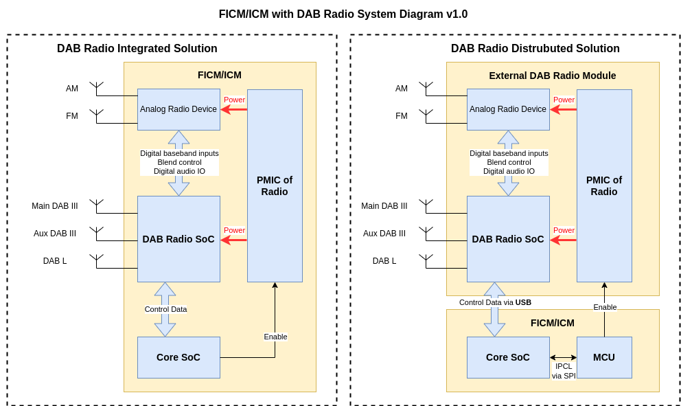

# Extreme Energy Saving Strategy for FICM - DAB Radio

## 1 Overview

### 1.1 Background

From the eletrical-battery-power-train vehicle perspective, any consumption of low-voltage-system eletrical components might produce the non-essentional waste of battery power, which could has impact to vehicle users' real capable mileage.

Therefore, this solution is trying to save low-voltage-system eletrical components consumption while users are not using. In addition, the applied energy saving solution would not cause any obvious unhappy exerperience from user standpoint.

### 1.2 Requirements Brief

Regarding to the external DAB radio module which has approximately 6W power consumption.

If an eletrical vehicle's power efficiency is 9km/1kwh, saving 6W power consumption could contribute approximately extra 6 multiplies 9 equals 54m of moving range per hour.

Therefore it is valuable to design and apply an "extreme" energy saving strategy for this extra 54m moving range from user usage perspective.

### 1.3 Acronyms

- FICM: Front Infortainment Control Module
- DAB: Digital Audio Broadcasting
- FM/AM Radio: Frequency Modulation/Analog Modulation Radio

## 2 Scope

### 2.1 Functional Scope

This documentation is **ONLY** applicable for the "extreme" energy saving strategy of _FICM_ radio functions:

- DAB
- FM/AM

### 2.2 Vehicle Program Scope

This documentation is **ONLY** applicable for SAIC international MG brand vehicles which installed the particular _FICM_ with _external DAB radio module_, or _independent DAB radio module_.

### 2.3 FICM Hardware Platform Scope

This documentation is **ONLY** applicable for _SAIC FICM2712 Platform with external DAB radio module_. From the _DAB radio module_ perspective, it is so-called "DAB Radio Distrubuted Solution" on the left side as bellow diagram.

## 3 Functional Requirements

### 3.1 REQ_EES_DABRADIO_000

User is allowed to disable DAB radio module while any radio feature not being running.

## 4 System Realization
