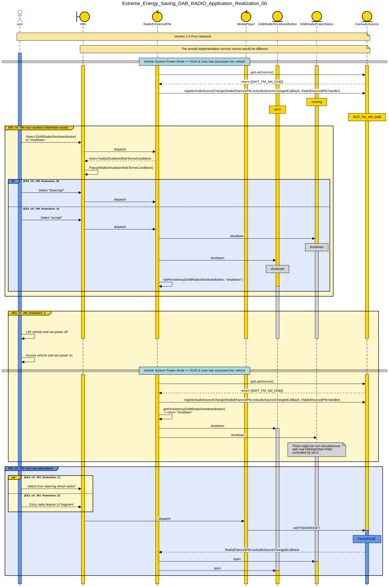
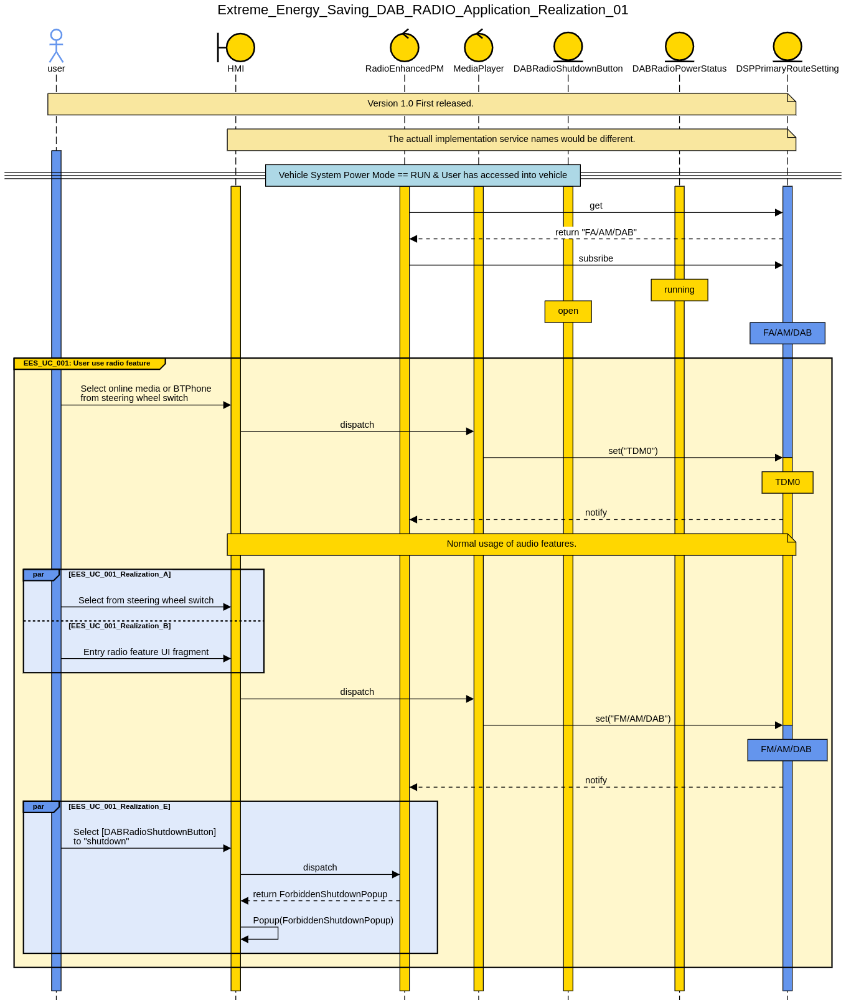
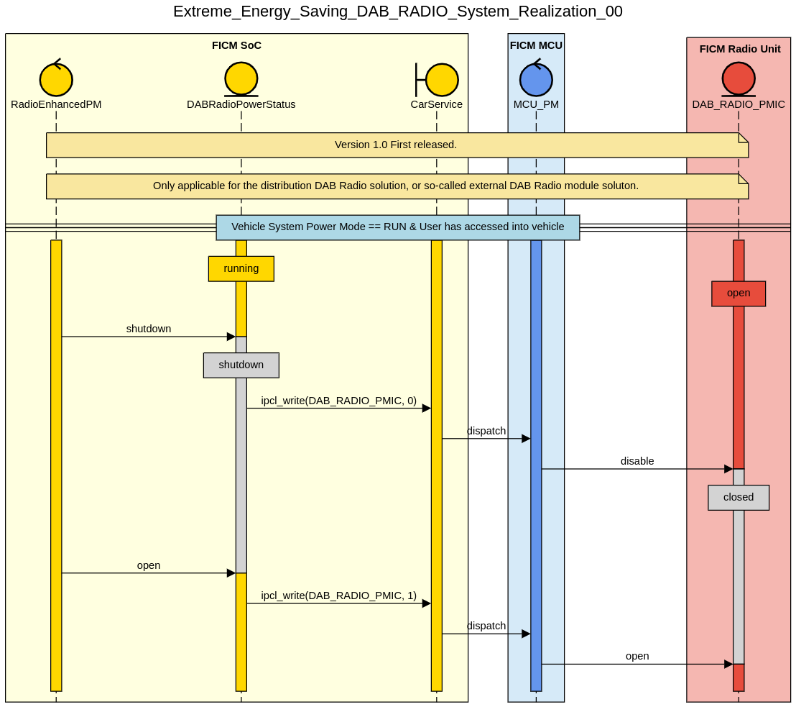

# Extreme Energy Saving Strategy for FICM - DAB Radio

## 0 Legend

| Version | Description     | Date       | Author                              |
| ------- | --------------- | ---------- | ----------------------------------- |
| 1.0     | First released. | 2023-12-11 | 罗均<br/>冯恺<br/>吴元春<br/>何蕾涛 |

## 1 Overview

### 1.1 Background

From the eletrical-battery-power-train vehicle perspective, any consumption of low-voltage-system eletrical components might produce the non-essentional waste of battery power, which could has impact to vehicle users' real capable mileage.

Therefore, this solution is trying to save low-voltage-system eletrical components consumption while users are not using. In addition, the applied energy saving solution would not cause any obvious unhappy exerperience from user standpoint.

### 1.2 Requirements Brief

Regarding to the external DAB radio module which has approximately 6W power consumption.

If an eletrical vehicle's power efficiency is 9km/1kwh, saving 6W power consumption could contribute approximately extra 6 multiplies 9 equals 54m of moving range per hour.

Therefore it is valuable to design and apply an "extreme" energy saving strategy for this extra 54m moving range from user usage perspective.

### 1.3 Acronyms

- FICM: Front Infortainment Control Module
- DAB: Digital Audio Broadcasting
- FM/AM Radio: Frequency Modulation/Analog Modulation Radio

## 2 Scope

### 2.1 Functional Scope

This documentation is **ONLY** applicable for the "extreme" energy saving strategy of _FICM_ radio functions:

- DAB
- FM/AM

### 2.2 Vehicle Program Scope

This documentation is **ONLY** applicable for SAIC international MG brand vehicles which installed the particular _FICM_ with _external DAB radio module_, or _independent DAB radio module_.

### 2.3 FICM Hardware Platform Scope

This documentation is **ONLY** applicable for _SAIC FICM2712 Platform with external DAB radio module_. From the _DAB radio module_ perspective, it is so-called "DAB Radio Distrubuted Solution" on the left side as bellow diagram.

### 2.3.1 DAB Radio Hardware Block Diagram - Distribution


### 2.3.2 DAB Radio Hardware Block Diagram - Integration


### 2.4 Regulation

- EN50067
- IEC62106
- UKSI 2017 / 1206 for radio equipment 2017 and all its amendments
- OFCOM standards
- etc.

Accessment: If the customer has physically and purposefully switched the radio unit off. Then should be ok for no broadcast functionality. The unit should not switch itself off whiledriving.  It must be a customer intervention.

## 3 Entities

### REQ_EES_ENT_000_HeadunitPowerMode

```json
{
  "EntityID": "REQ_EES_ENT_000",
  "EntityName": "HeadunitPowerMode",
  "EntityType": "",
  "DataType": "Enumeration",
  "ValueRange": { "shutdown": 0, "suspendToRAM": 1, "running": 2 },
  "InitialValue": "shutdown",
  "Comments": ""
}
```

### REQ_EES_ENT_001_DABRadioPowerStatus

```json
{
  "EntityID": "REQ_EES_ENT_001",
  "EntityName": "DABRadioPowerStatus",
  "EntityType": "",
  "DataType": "Enumeration",
  "ValueRange": { "shutdown": 0, "suspended": 1, "running": 2 },
  "InitialValue": "shutdown",
  "Comments": ""
}
```

### REQ_EES_ENT_002_DSPPrimaryRouteSetting

```json
{
  "EntityID": "REQ_EES_ENT_002",
  "EntityName": "",
  "EntityType": "DSPPrimaryRouteSetting",
  "DataType": "Enumeration",
  "ValueRange": { "FM/AM/DAB": 0, "TDM0": 1 },
  "InitialValue": "TDM0",
  "Comments": ""
}
```

Note: More DSPPrimaryRouteSetting details refers to [MT2712 FICM Audio Path](#mt2712-ficm-audio-path)

### REQ_EES_ENT_003_RadioSource

```json
{
  "EntityID": "REQ_EES_ENT_002",
  "EntityName": "Select",
  "EntityType": "",
  "DataType": "Enumeration",
  "ValueRange": { "FM": 0, "AM": 1, "DAB": 2, "EWS": 3 },
  "InitialValue": "FM",
  "Comments": ""
}
```

### REQ_EES_ENT_010_DABRadioShutdownButton

```json
{
  "EntityID": "REQ_EES_ENT_010",
  "EntityName": "DABRadioShutdownButton",
  "EntityType": "Button",
  "DataType": "Enumeration",
  "ValueRange": { "open": 0, "shutdown": 1, "disabled": 2 },
  "InitialValue": "open",
  "Comments": ""
}
```

### REQ_EES_ENT_020_ForbiddenShutdownPopup

```json
{
  "EntityID": "REQ_EES_ENT_020",
  "EntityName": "ForbiddenShutdownPopup",
  "EntityType": "Popup",
  "DataType": "",
  "ValueRange": "",
  "InitialValue": "",
  "Comments": "Info user is not allowed to shutdown DAB radio while radio is running."
}
```

### REQ_EES_ENT_021_RadioShutdownRiskTermsConditions

```json
{
  "EntityID": "REQ_EES_ENT_021",
  "EntityName": "RadioShutdownRiskTermsConditions",
  "EntityType": "TermsConditions",
  "DataType": "Enumeration",
  "ValueRange": { "disaccept": 0, "accept": 1 },
  "InitialValue": "disaccept",
  "Comments": "To remind user the risk of shutting down radio unit."
}
```

## 4 Functional Requirements

### 4.1 REQ_EES_DABRADIO_000

#### 4.1.1 Description

User is allowed to shutdown DAB radio module while any radio function not being running.

#### 4.1.2 Pre-conditions

- User has not been using any of radio function.

#### 4.1.3 Use Cases

- [EES_UC_000: User shutdown DAB Radio module](#51-ees_uc_000-user-shutdown-dab-radio-module)

#### 4.1.4 Post-conditions

- [DABRadioShutdownButton](#req_ees_ent_010_dabradioshutdownbutton) shows as _shutdown_ status

#### 4.1.5 Dependecies

N/A

### 4.2 REQ_EES_DABRADIO_001

#### 4.2.1 Description

User is **NOT** allowed to shutdown DAB radio module while any radio feature is running.

#### 4.2.2 Pre-conditions

- User has been using any of radio function.

#### 4.2.3 Use Cases

- [EES_UC_000: User shutdown DAB Radio module](#51-ees_uc_000-user-shutdown-dab-radio-module)

#### 4.2.4 Post-conditions

- User has been informed that the radio unit is not allowed to shutdown while radion funciton is running only

### 4.3 REQ_EES_DABRADIO_002

#### 4.3.1 Description

User is **ALWAYS** to have radio feature while [DABRadioPowerStatus](#req_ees_ent_001_dabradiopowerstatus) is at _shutdown_ status

- [EES_UC_001: User use radio feature](#52-ees_uc_001-user-use-radio-feature)

#### 4.3.2 Pre-conditions

- FICM [HeadunitPowerMode](#req_ees_ent_000_headunitpowermode) is at _running_

#### 4.3.3 Use Cases

- [EES_UC_001: User use radio feature](#52-ees_uc_001-user-use-radio-feature)

#### 4.3.4 Post-conditions

- [DABRadioShutdownButton](#req_ees_ent_010_dabradioshutdownbutton) button has been in _open_ status

## 5 Use Cases

### 5.1 EES_UC_000: User shutdown DAB Radio module

#### EES_UC_000_Realization_A

- Actor: Vehicle User
- Pre-conditions:
  - FICM [HeadunitPowerMode](#req_ees_ent_000_headunitpowermode) is at _running_
  - [DABRadioShutdownButton](#req_ees_ent_010_dabradioshutdownbutton) button has been in _open_ status
  - [DSPPrimaryRouteSetting](#req_ees_ent_002_dspprimaryroutesetting) is set at _TDM0_
- Activity:
  - User clicks [DABRadioShutdownButton](#req_ees_ent_010_dabradioshutdownbutton)
  - User has been informed by [RadioShutdownRiskTermsConditions](#req_ees_ent_021_radioshutdownrisktermsconditions)
  - User clicks **ACCEPT** of [RadioShutdownRiskTermsConditions](#req_ees_ent_021_radioshutdownrisktermsconditions)
- Post-conditions (expectation):
  - [DABRadioShutdownButton](#req_ees_ent_010_dabradioshutdownbutton) button has been in _shutdwon_ status
  - [DABRadioPowerStatus](#req_ees_ent_001_dabradiopowerstatus) has been in _shutdown_ status

#### EES_UC_000_Realization_B

- Actor: Vehicle User
- Pre-conditions:
  - FICM [HeadunitPowerMode](#req_ees_ent_000_headunitpowermode) is at _running_
  - [DABRadioShutdownButton](#req_ees_ent_010_dabradioshutdownbutton) button has been in _open_ status
  - [DSPPrimaryRouteSetting](#req_ees_ent_002_dspprimaryroutesetting) is set at _FM/AM/\_TDM0_
- Activity:
  - User clicks [DABRadioShutdownButton](#req_ees_ent_010_dabradioshutdownbutton)
  - User has been informed by [RadioShutdownRiskTermsConditions](#req_ees_ent_021_radioshutdownrisktermsconditions)
  - User clicks **DISACCEPT** of [RadioShutdownRiskTermsConditions](#req_ees_ent_021_radioshutdownrisktermsconditions)
- Post-conditions (expectation):
  - [ForbiddenShutdownPopup](#req_ees_ent_020_forbiddenshutdownpopup) shows up
  - [DABRadioShutdownButton](#req_ees_ent_010_dabradioshutdownbutton) button keeps in _open_ status
  - [DABRadioPowerStatus](#req_ees_ent_001_dabradiopowerstatus) has keeps in _running_ status

### 5.2 EES_UC_001: User use radio feature

#### EES_UC_001_Realization_A

- Actor: Vehicle User
- Pre-conditions:
  - FICM [HeadunitPowerMode](#req_ees_ent_000_headunitpowermode) is at _running_
  - [DABRadioShutdownButton](#req_ees_ent_010_dabradioshutdownbutton) button has been in _open_ status
  <!-- - [DSPPrimaryRouteSetting](#req_ees_ent_002_dspprimaryroutesetting) is set at _TDM0_ -->
- Activity:
  - User uses FM/AM/Radio feature by switching audio source via steering wheel switch.
- Post-conditions (expectation):
  - [DABRadioShutdownButton](#req_ees_ent_010_dabradioshutdownbutton) button keeps in _open_ status
  - [DABRadioPowerStatus](#req_ees_ent_001_dabradiopowerstatus) has keeps in _running_ status

#### EES_UC_001_Realization_B

- Actor: Vehicle User
- Pre-conditions:
  - FICM [HeadunitPowerMode](#req_ees_ent_000_headunitpowermode) is at _running_
  - [DABRadioShutdownButton](#req_ees_ent_010_dabradioshutdownbutton) button has been in _open_ status
  <!-- - [DSPPrimaryRouteSetting](#req_ees_ent_002_dspprimaryroutesetting) is set at _TDM0_ -->
- Activity:
  - User uses FM/AM/DAB feature by pressing FM/AM/DAB function entries on HMI foreground(display screen).
- Post-conditions (expectation):
  - [DABRadioShutdownButton](#req_ees_ent_010_dabradioshutdownbutton) button keeps in _open_ status
  - [DABRadioPowerStatus](#req_ees_ent_001_dabradiopowerstatus) has keeps in _running_ status

#### EES_UC_001_Realization_C

- Actor: Vehicle User
- Pre-conditions:
  - FICM [HeadunitPowerMode](#req_ees_ent_000_headunitpowermode) is at _running_
  - [DABRadioShutdownButton](#req_ees_ent_010_dabradioshutdownbutton) button has been in _shutdown_ status
  - [DSPPrimaryRouteSetting](#req_ees_ent_002_dspprimaryroutesetting) is set at _TDM0_
- Activity:
  - User uses FM/AM/Radio feature by switching audio source via steering wheel switch.
- Post-conditions (expectation):
  - [DABRadioShutdownButton](#req_ees_ent_010_dabradioshutdownbutton) button changes to _open_ status
  - [DABRadioPowerStatus](#req_ees_ent_001_dabradiopowerstatus) has power on to _running_ status

#### EES_UC_001_Realization_D

- Actor: Vehicle User
- Pre-conditions:
  - FICM [HeadunitPowerMode](#req_ees_ent_000_headunitpowermode) is at _running_
  - [DABRadioShutdownButton](#req_ees_ent_010_dabradioshutdownbutton) button has been in _shutdown_ status
  - [DSPPrimaryRouteSetting](#req_ees_ent_002_dspprimaryroutesetting) is set at _TDM0_
- Activity:
  - User uses FM/AM/DAB feature by pressing FM/AM/DAB function entries on HMI foreground(display screen).
- Post-conditions (expectation):
  - [DABRadioShutdownButton](#req_ees_ent_010_dabradioshutdownbutton) button changes to _open_ status
  - [DABRadioPowerStatus](#req_ees_ent_001_dabradiopowerstatus) has power on to _running_ status

#### EES_UC_001_Realization_E

- Actor: Vehicle User
- Pre-conditions:
  - FICM [HeadunitPowerMode](#req_ees_ent_000_headunitpowermode) is at _running_
  - [DABRadioShutdownButton](#req_ees_ent_010_dabradioshutdownbutton) button has been in _open_ status
  - [DSPPrimaryRouteSetting](#req_ees_ent_002_dspprimaryroutesetting) is set at _FM/AM/DAB_
- Activity:
  - User clicks [DABRadioShutdownButton](#req_ees_ent_010_dabradioshutdownbutton)
- Post-conditions (expectation):
  - [ForbiddenShutdownPopup](#req_ees_ent_020_forbiddenshutdownpopup) shows up
  - [DABRadioShutdownButton](#req_ees_ent_010_dabradioshutdownbutton) button keeps in _open_ status
  - [DABRadioPowerStatus](#req_ees_ent_001_dabradiopowerstatus) has keeps in _running_ status

## 6 System Realization

### 6.1 Application Realization

#### Extreme_Energy_Saving_DAB_RADIO_Application_Realization_00

**Covered Use Cases:**

- [EES_UC_000: User shutdown DAB Radio module](#51-ees_uc_000-user-shutdown-dab-radio-module)
- [EES_UC_001_Realization_C](#ees_uc_001_realization_c)
- [EES_UC_001_Realization_D](#ees_uc_001_realization_d)



#### Extreme_Energy_Saving_DAB_RADIO_Application_Realization_01

**Covered Use Cases:**

- [EES_UC_001_Realization_A](#EES_UC_001_Realization_A)
- [EES_UC_001_Realization_B](#EES_UC_001_Realization_B)
- [EES_UC_001_Realization_E](#EES_UC_001_Realization_E)



### 6.2 System Realization

#### EES_DAB_RADIO_System_Realization_00

**Description:** System open/shutdown external DAB Radio module.


### 6.3 Performance Metrics

| UseCase                             | Latency(ms) | SuccessRate(%) | LifeDuration(counts) |
| ----------------------------------- | ----------- | -------------- | -------------------- |
| EES_DAB_RADIO_System_Realization_00 | < 1500      | 99.99          | 100k                 |

## Appendix

### MT2712 FICM Audio Path


```

```
